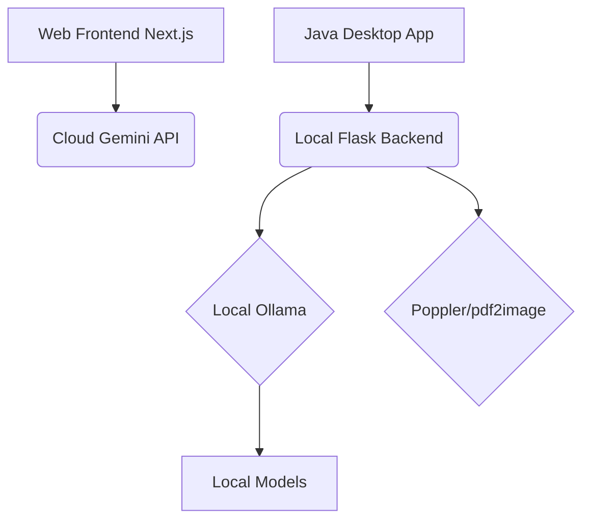

# Quiz Application

A comprehensive quiz generation platform offering both a **Web Version** and a **Desktop Edition**, powered by AI for automatic PDF analysis and quiz generation.

## 🚀 Unified Architecture

The repository contains three main components:
1. **Web Frontend (`web/`)**: A Next.js web application built with React, Tailwind CSS, and Framer Motion. It leverages the Gemini API for cloud-based vision processing and RAG to generate quizzes on the fly.
2. **Desktop Client (`desktop/java-client/`)**: A native Java Swing application for lightweight, native performance, and offline capabilities.
3. **Local Python Backend (`desktop/python-backend/`)**: A local Flask server that processes PDFs using `pdf2image` and `poppler`, running a local RAG pipeline powered by **Ollama** (e.g. `llava` model).



## 🌐 Web Version

The Next.js application serves as the main landing page and web-based quiz interface.

### Features
- **Modern UI**: Dark-mode glassmorphism design with dynamic animations.
- **Gemini AI**: Uses Google's Gemini Vision models for extracting text from PDFs and generating context-aware quizzes.
- **Serverless**: Connects directly to serverless APIs to perform quiz generation securely.
- **Desktop Download**: Provides an installer (`QuizGeneratorSetup.exe`) to download the offline Desktop Edition.

### Running the Web Version
```bash
cd web
npm install
npm run dev
```
Open `http://localhost:3000` to view the application.

## 💻 Desktop Edition

The Desktop Edition keeps the existing Java UI behavior and communicates with the Python backend entirely through HTTP, avoiding direct python script execution from Java.

### Offline & Local AI

1. Start Ollama locally.
2. Run the Python backend in `desktop/python-backend/` (`python app.py`).
3. Launch the Java Swing client.
4. Drop a PDF in the UI; Java sends the PDF to Flask over HTTP, where RAG and Ollama generate the quiz JSON locally.

### Packaging

The desktop edition can be built into a standalone Windows Installer (`QuizGeneratorSetup.exe`) using PyInstaller and Inno Setup, which is also distributed via the web version.

## 🛠 Documentation

- [Web Architecture](./web/README.md)
- [Desktop Java/Python Setup](./desktop/README.md)
- [Backend Architecture](./backend/architecture.md)
