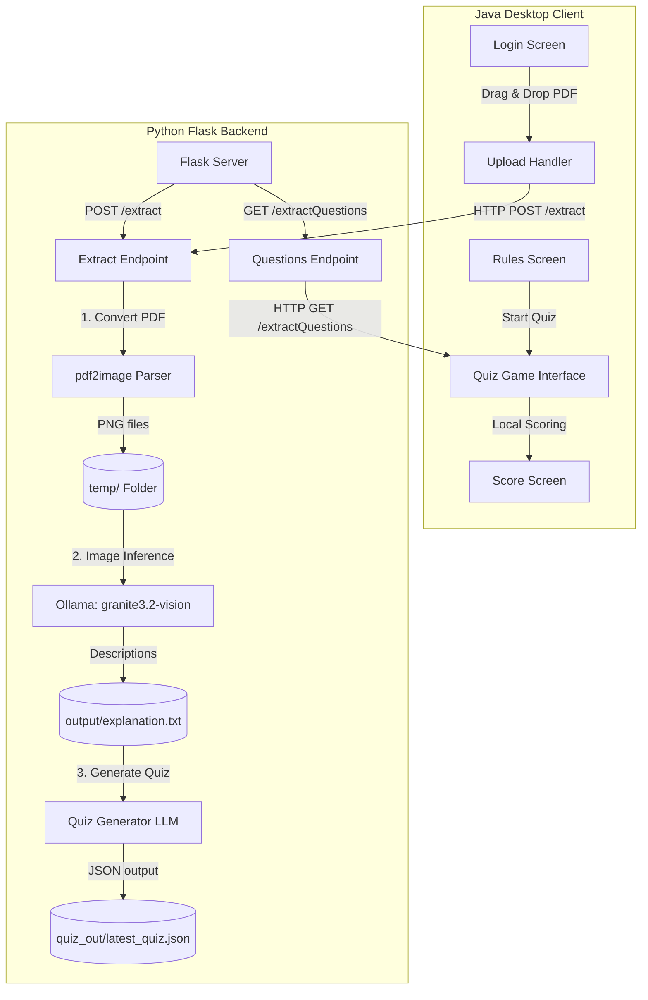
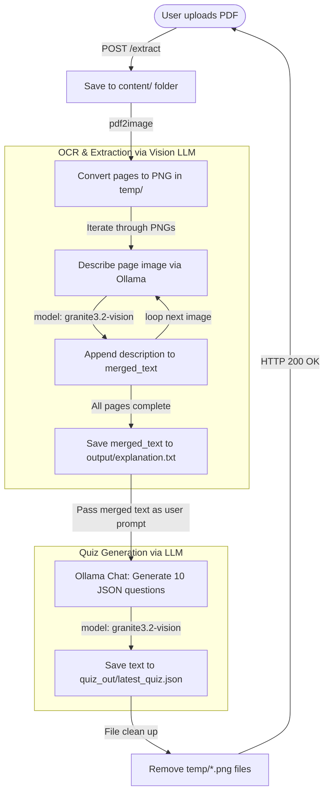
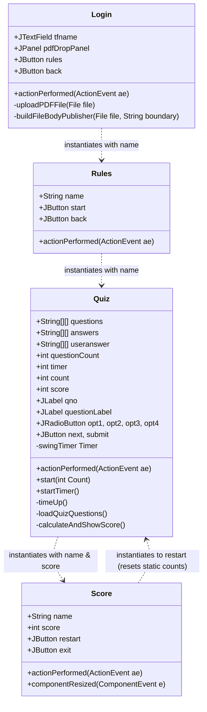
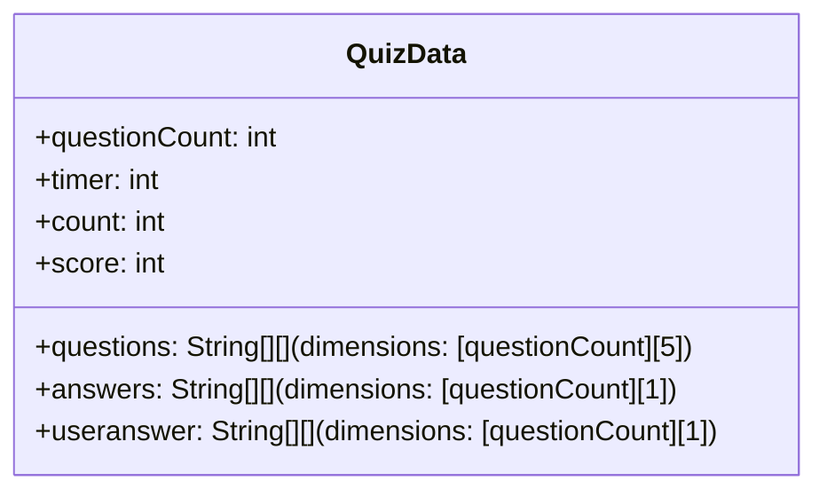
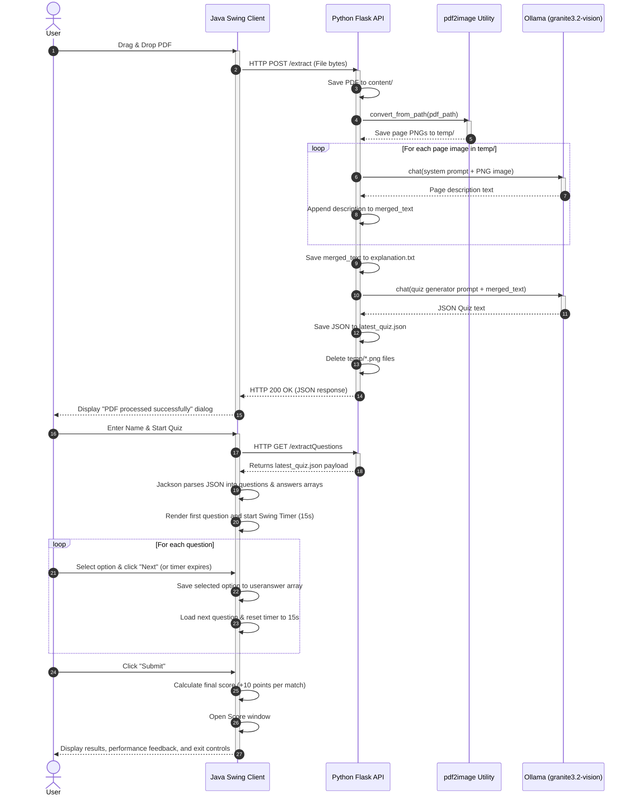

# Comprehensive Architecture Discovery and Reverse-Engineering Audit Report

This report presents a thorough, code-validated architecture discovery and reverse-engineering audit of the repository located at `d:\Univeristy\VIT\Quiz-Application`.

---

## 1. High-Level System Overview

The system is a distributed application that generates interactive quiz questions from user-uploaded PDF documents. It consists of two major components:
1. **Java Swing Desktop Client**: Acts as the user interface for authenticating (by name), uploading PDFs, taking the timed quiz, and viewing results.
2. **Python Flask Backend**: A server that processes uploaded PDFs, extracts content using a local Vision LLM, and formats the content into a structured quiz using another LLM prompt.

### System Architecture Diagram


### Module Responsibilities
- **`Login.java`**: Initiates the application. Provides UI for entering the user's name and a Drag & Drop area where a PDF is accepted, read, and POSTed to the backend.
- **`Rules.java`**: A bridge screen showing static instructions and configuring user-flow routing.
- **`Quiz.java`**: Handles the core quiz loop. It queries the backend for the generated questions, presents them to the user one-by-one under a 15-second timer per question, records selections, and initiates score calculations. It contains an inline `Score` class.
- **`Score.java`**: A separate, polished component that handles rendering results with responsive window-resize handlers and score-based feedback.
- **`RAG_Test.ipynb` (Python Server)**: Runs a Flask listener. It handles incoming files, uses system-level Poppler to extract PDF page images, invokes local model `granite3.2-vision` to describe pages, and prompts the same model to build a JSON quiz from the description texts.

---

## 2. Repository Structure

Below is an overview of the workspace directory hierarchy and the responsibilities of each directory and key file:

```
Quiz-Application/
├── .git/                               # Version control repository metadata
├── .gitignore                          # Exclusions for git version control
├── LICENSE                             # License file (MIT License)
├── package.json                        # Node project manifest (unused orphaned dependency: motion)
├── package-lock.json                   # Locked dependency tree for Node (unused)
├── README.md                           # Startup, installation, and user instructions
├── Quiz Application/                   # Desktop client subdirectory
│   ├── .vscode/
│   │   └── settings.json               # Configures Java classpath and referenced library paths
│   ├── login.jpg                       # Asset for Login screen background
│   ├── quiz.jpg                        # Asset for Quiz screen background (unused due to hardcoded path bug)
│   ├── score.jpg                       # Asset for Score screen background
│   └── src/                            # Java Source code (default package)
│       ├── Login.java                  # Main entry point, UI layout, Drag-and-Drop and HTTP uploader
│       ├── Rules.java                  # Display instructions, screen transition controller
│       ├── Quiz.java                   # Quiz game engine, HTTP retriever, Jackson mapper, and basic Score display
│       └── Score.java                  # Responsive layout Score window implementing ComponentListener
├── RAG_test/                           # Python backend subdirectory
│   ├── .vscode/
│   │   └── settings.json               # CMake plugin suppression config
│   ├── RAG_Test.ipynb                  # Jupyter Notebook containing Flask API and LLM pipeline code
│   ├── poppler-24.08.0/                # Windows Poppler binary distribution folder
│   │   ├── Library/
│   │   │   └── bin/                    # Executable Poppler utilities (pdftoppm, pdfimages, etc.)
│   │   └── share/
│   ├── content/                        # Directory created at runtime to cache uploaded PDF documents
│   ├── temp/                           # Directory created at runtime to cache converted page PNGs
│   ├── output/                         # Directory created at runtime caching explanation.txt descriptions
│   └── quiz_out/                       # Directory created at runtime containing latest_quiz.json
```

---

## 3. Backend Architecture

### Framework
The backend is built using **Flask** (version unpinned in the files). It runs a standard WSGI application locally.

### Entry Point & Startup Flow
The backend's entry point is the Jupyter Notebook file [RAG_Test.ipynb](file:///d:/Univeristy/VIT/Quiz-Application/RAG_test/RAG_Test.ipynb). 
The Flask server is started by running the notebook's cells sequentially. The server initialization is defined in the final cells:
```python
def run_app():
    app.run(host='0.0.0.0', port=5000, debug=True, use_reloader=False)

thread = threading.Thread(target=run_app)
thread.start()
```
- **Threaded Execution**: Starts the Flask server in a secondary thread, allowing the notebook process to remain interactive.
- **Reloader Disabled**: `use_reloader=False` is set to prevent duplicate Flask server threads within the interactive notebook environment.

### Dependency Injection
There is **no dependency injection framework** (like Dependency Injector or FastAPI's Depends) implemented. Component references are hardcoded:
- The Ollama library interface is called directly using global module-level calls (`ollama.chat`).
- The Flask request context and global folder paths are accessed directly inside route definitions.

### Configuration & Environment Variables
The application does not use `.env` files, config files (like YAML/JSON config), or environment variables. All parameters are **hardcoded**:
- Port is hardcoded to `5000`.
- Host is hardcoded to `0.0.0.0`.
- Model name is hardcoded to `"granite3.2-vision"`.
- Poppler bin path is hardcoded to `"poppler-24.08.0/Library/bin"`.
- Directories are hardcoded to `["content", "temp", "output", "quiz_out"]`.

### Models, Schemas & Services
- **Models/Schemas**: No ORM models (e.g., SQLAlchemy) or data-validation schemas (e.g., Pydantic) exist. Data payload structures are represented as plain python dictionaries, lists, and strings.
- **Services/Utilities**:
  - `findname(filename)`: Standard parsing code to strip extension. (Note: Defined in Cell 3 but never called or utilized).
  - `createimages(pdf_path)`: Converts PDFs to PNG images.
  - `inferenceimages()`: Executes vision LLM page descriptions and saves them.
  - `textfiletoquiz(ques, input_text)`: Instructs the LLM to format questions into JSON.
  - `cleanup()`: Purges files from `temp/`.

### Exception Handling & Logging
- **Exception Handling**:
  - Route `/extract`: Wrapped in a `try-except` block. If any step of the extraction pipeline fails, it returns HTTP 500 JSON `{"error": "Processing error: <exception_message>"}`.
  - Route `/extractQuestions`: Wrapped in `try-except`. If reading or parsing `latest_quiz.json` fails, it returns HTTP 500 JSON `{"error": "Error reading quiz data: <exception_message>"}`.
  - Internal functions catch exceptions locally, print statements (`print("Error during image inference:", e)`), and re-raise (`raise`) to let the endpoint responder handle the HTTP status.
- **Logging**: No standard python logging library (`logging`) is configured. The application uses basic stdout printing (`print()`) to log server progress, file paths, and operations to the stdout shell of the notebook.

---

## 4. REST API Documentation

The Flask server listens on port `5000` and exposes two endpoints:

### 1. `POST /extract`
- **Purpose**: Uploads a PDF document, parses it into page images, performs Vision-based text extraction, generates a quiz, and saves the quiz details.
- **Request Format**: Multipart Form-Data (`multipart/form-data`)
  - **Body Parameter**:
    - `file`: (Binary) The PDF document file.
- **Validation**:
  - Validates that the request contains the form-data key `'file'`. If missing, returns status `400` with JSON:
    ```json
    { "error": "No file provided" }
    ```
  - Validates that a file is selected (filename is not empty). If empty, returns status `400` with JSON:
    ```json
    { "error": "No file selected" }
    ```
  - Validates file extension is `.pdf` (case-insensitive checks on extension). If invalid, returns status `400` with JSON:
    ```json
    { "error": "Uploaded file is not a PDF" }
    ```
- **Response Format**: `application/json`
  - **Success Response (200 OK)**:
    ```json
    {
      "message": "PDF processed successfully",
      "quiz": "{\n   \"questions\": [\n     {\n        \"question\": \"Who was Mohandas Karamchand Gandhi?\",\n        \"options\": [\n           \"An Indian lawyer and anti-colonial nationalist\",\n           \"A British general\",\n           \"A South African merchant\",\n           \"A French ethicist\"\n        ],\n        \"answer\": \"An Indian lawyer and anti-colonial nationalist\"\n     }\n   ]\n}"
    }
    ```
    *(Note: The `"quiz"` property value is returned as a serialized JSON string representing the raw output of the LLM).*
  - **Error Response (500 Internal Server Error)**:
    ```json
    {
      "error": "Processing error: [Details of error, e.g., Ollama connection refused]"
    }
    ```

---

### 2. `GET /extractQuestions`
- **Purpose**: Retrieves the quiz generated by the latest PDF upload.
- **Request Format**: None (no body or query parameters accepted).
- **Response Format**: `application/json`
  - **Success Response (200 OK)**:
    ```json
    {
      "questions": [
        {
          "question": "Question text detail",
          "options": [
            "Option A value",
            "Option B value",
            "Option C value",
            "Option D value"
          ],
          "answer": "Option A value"
        }
      ]
    }
    ```
  - **Error Response (500 Internal Server Error)**:
    ```json
    {
      "error": "Error reading quiz data: [Errno 2] No such file or directory: 'quiz_out\\\\latest_quiz.json'"
    }
    ```

---

### OpenAPI-Style API Summary

```yaml
openapi: 3.0.3
info:
  title: Quiz Application Backend API
  version: 1.0.0
  description: API for converting PDF documents into structured quiz questions using Ollama LLM models.
paths:
  /extract:
    post:
      summary: Upload PDF and generate quiz
      description: Uploads a PDF file, splits it into images, extracts page descriptions, and prompts the LLM to write questions.
      requestBody:
        required: true
        content:
          multipart/form-data:
            schema:
              type: object
              properties:
                file:
                  type: string
                  format: binary
                  description: The PDF file to be processed.
      responses:
        '200':
          description: Processing succeeded
          content:
            application/json:
              schema:
                type: object
                properties:
                  message:
                    type: string
                    example: PDF processed successfully
                  quiz:
                    type: string
                    description: Serialized JSON quiz string generated by the LLM.
        '400':
          description: Client-side validation failure
          content:
            application/json:
              schema:
                type: object
                properties:
                  error:
                    type: string
                    example: Uploaded file is not a PDF
        '500':
          description: Server-side processing failure
          content:
            application/json:
              schema:
                type: object
                properties:
                  error:
                    type: string
                    example: "Processing error: Poppler path error"

  /extractQuestions:
    get:
      summary: Get the latest generated quiz
      description: Reads the last generated quiz questions from disk cache.
      responses:
        '200':
          description: Success
          content:
            application/json:
              schema:
                type: object
                properties:
                  questions:
                    type: array
                    items:
                      type: object
                      properties:
                        question:
                          type: string
                        options:
                          type: array
                          items:
                            type: string
                        answer:
                          type: string
        '500':
          description: Server failed to read quiz data file
          content:
            application/json:
              schema:
                type: object
                properties:
                  error:
                    type: string
```

---

## 5. RAG Pipeline Discovery

Although the directory and notebook are named `RAG_test`, a review of the code reveals that **there is no true Retrieval-Augmented Generation (RAG) pipeline** implemented in this project. Specifically:
- **No Chunking Strategy**: The system does not divide documents into semantic text chunks.
- **No Embeddings**: It does not compute vector embeddings.
- **No Vector Database**: There is no vector database (e.g. Chroma, FAISS, Pinecone) to persist indexes.
- **No Retriever**: There is no semantic search or index look-up interface.

Instead, the system utilizes a **Vision-to-Text-to-JSON Synthesis Pipeline**. Below is a detailed flowchart of the actual pipeline:



### Pipeline Steps in Detail:
1. **PDF Upload**: Handled in `/extract`. The PDF file is stored under `content/<original_filename>`.
2. **PDF Parsing (Page Separation)**: Executed by `createimages()`. The backend calls `pdf2image.convert_from_path`, pointing to the local Poppler binaries at `poppler-24.08.0/Library/bin`. Each page of the PDF is converted to a PNG image at `temp/output_page_<page_index>.png`.
3. **Text Extraction (Image-to-Text OCR)**: Executed by `inferenceimages()`. The code reads and sorts the files in the `temp/` folder. For each image, it makes a call to the local Ollama instance running the **`granite3.2-vision`** model. The call structures the path to the image directly inside the system message dictionary:
   ```python
   messages=[{
       'role': 'system',
       'content': "Analyze the given image...",
       'images': [f'{image_path}']
   }]
   ```
   The model describes the contents of the page in concise bullet points. The results are accumulated into a single `merged_text` string and written to `output/explanation.txt`.
4. **Prompt Construction**: Executed by `textfiletoquiz()`. It structures a system prompt instructing the model to act as an "edututor substitute model", filter out irrelevant data from the vision description, generate a requested number of quiz questions (defaults to 10), provide 4 options where one is correct, return the correct option under the `"answer"` key, and write explanations if possible (or return `"NA"`). It requests the output in a strict JSON schema.
5. **LLM Execution**: The prompt and the concatenated text descriptions (`merged_text`) are passed to the **`granite3.2-vision`** model via Ollama. *(Note: The code reuses the Vision model for text processing instead of switching to a standard text LLM).*
6. **JSON Quiz Generation & Output Formatting**: The LLM's raw text response is written to `quiz_out/latest_quiz.json` and returned inside the REST response of `/extract`.

---

## 6. Quiz Generation Pipeline

The generation of quiz questions relies on the behavior of the `granite3.2-vision` model.

### Prompt Details
```
You are an edututor substitute model, whose function is to create quizzes. You will receive a query. This query is an output from a Vision Model.
Clean the text to remove irrelevant data, and generate {ques} quiz questions from the given data.
You must not only generate a question and subsequent 4 options, but also one of the option must be true. You must also return 1 correct option from the given options, and explaination if possible. return NA if no explaination.
Return the output as valid JSON in the following format:
{
   "questions": [
     {
        "question": "Question text",
        "options": [provide 4 options here],
        "answer": provide the answer here
     }
     // Repeat for each question
   ]
}
Ensure the JSON is valid.
```

- **Difficulty**: Not specified. The LLM generates questions of arbitrary difficulty based on the provided text.
- **Options**: Hardcoded to 4 options.
- **Correct Answer Selection**: The model selects the correct option from the four options and prints it in the `"answer"` property.
- **Scoring**: Calculated locally in the Java client in `calculateAndShowScore()`. The client loops through all questions and awards 10 points for each question where the user's selection exactly matches the `"answer"` property. The maximum possible score is calculated as `questionCount * 10` (the default generated count is 10, resulting in 100 maximum points, which is hardcoded in the Score labels).
- **Data Models & Schema**:
  - The model outputs a JSON string.
  - The Java application parses it using Jackson `ObjectMapper.readTree()`, looking for a root `"questions"` key, mapping `question`, the array `options` (indices 0 to 3 mapped to index 1 to 4 in a Java array), and `answer`.
- **Validation**:
  - There is **no validation** on the Python side before saving to disk. If the LLM generates markdown text (e.g. ```json ... ```) or conversational commentary outside the JSON structure, the backend will still save the raw string.
  - The Java application reads `latest_quiz.json` via `/extractQuestions`. If the JSON is invalid, the Java class will catch a Jackson mapping exception and show an error dialog.

---

## 7. Java Desktop Client

The Java desktop client is built on **Java Swing (AWT)**.

### UI Architecture & Layout System
- The interface relies on absolute layouts. Every window uses `setLayout(null)`.
- Component bounds are defined using absolute coordinate layouts (`setBounds(x, y, width, height)`).
- Custom components, buttons, and backgrounds use solid color hex keys (e.g., standard light blue: `new Color(30, 144, 254)`).

### Main Windows & Flow
1. **`Login` (Window)**:
   - Size: 1200x500.
   - Layout: Left side displays `login.jpg`. Right side displays the application title `JETSO TESTO`, a `JTextField` for the name, a `Rules` button, and a `Back` button.
   - Drag & Drop PDF Panel: Underneath the input fields is a `JPanel` configured with a `DropTarget`. When a user drops a file, a custom `DropTargetAdapter` intercepts it, checks that it is a `.pdf`, and triggers `uploadPDFFile()`.
2. **`Rules` (Window)**:
   - Size: 800x650.
   - Displays instructions for the test: 15-second timers, 4 options, no negative markings.
   - Has a `Start` button (creates `new Quiz(name)`) and a `Back` button (returns to `Login`).
3. **`Quiz` (Window)**:
   - Size: 1440x850.
   - Top 50% displays `quiz.jpg` (subject to the absolute file path bug detailed below).
   - Bottom 50% displays the active question, question number, and 4 `JRadioButton` components inside a `ButtonGroup` to enforce mutual exclusion.
   - Action controls: `Next` (advances index, saves selection, restarts timer) and `Submit` (saves final selection, calculates score, launches results).
4. **`Score` (Window)**:
   - **Inline implementation (in `Quiz.java`)**: Hardcoded boundaries (750x550), basic text labels displaying score and performance, and "Restart Quiz" or "Exit" buttons.
   - **Standalone implementation (`Score.java`)**: Size: 800x600 (scaled dynamically to 60% width and 70% height of screen). Implements `ComponentListener` to scale the image `score.jpg` and resize typography dynamically during window resize events.

### Controllers & Event Handling
- No MVC controllers exist. Each screen class implements standard Java AWT interfaces `ActionListener` and `ComponentListener`, overriding `actionPerformed(ActionEvent ae)` and `componentResized(ComponentEvent e)` to route user events locally.

### REST Networking & Communication
- Employs the native Java HTTP Client (`java.net.http.HttpClient`).
- **PDF Upload Request (`Login.java`)**:
  - Executes a `POST http://localhost:5000/extract`.
  - Content-Type is set to `multipart/form-data; boundary=----WebKitFormBoundary7MA4YWxkTrZu0gW`.
  - The method `buildFileBodyPublisher` builds the raw multipart byte array manually by stitching the boundary, file parts, file bytes, and ending boundary together.
- **Fetch Quiz Request (`Quiz.java`)**:
  - Executes a `GET http://localhost:5000/extractQuestions`.
  - Parses the JSON string using Jackson library `ObjectMapper` and maps values to arrays.

### State Management
- Stored as static variables in `Quiz` class:
  - `public static int timer = 15;` (Remaining time for active question)
  - `public static int count = 0;` (Current question index)
  - `public static int score = 0;` (User score)
- Other parameters (like username and scores) are passed across components via constructor parameters:
  - `new Rules(name)` -> `new Quiz(name)` -> `new Score(name, score)`.

### Class Relationship Diagram



---

## 8. Frontend Readiness

This section details whether the current Flask backend is ready to support a modern **Next.js** frontend.

### Reusable APIs
- The backend has two functional endpoints: `POST /extract` and `GET /extractQuestions`. These are sufficient to upload a document and retrieve the questions.

### Missing APIs for Web/Next.js
- **No Results Persistence API**: The backend does not store score results. Scoring is calculated client-side in the Java UI memory. For a web frontend, an API to save scores, associate them with users, and retrieve performance history is missing.
- **No Multi-Quiz/Session Management API**: The backend only stores one global quiz file (`latest_quiz.json`). There is no endpoint to fetch list of generated quizzes, query quizzes by ID, or delete old records.
- **No Authentication API**: No login, JWT generation, or user authentication exists.

### Potential Issues and Concerns
- [!WARNING]
  **No CORS Support**: The Flask app does not configure Cross-Origin Resource Sharing (CORS). Web-based browsers loading a Next.js app on `localhost:3000` will block fetch requests to Flask on `localhost:5000` due to Same-Origin policy.
- [!IMPORTANT]
  **No Concurrency Support**: The backend uses static, hardcoded file folders (`temp/`, `content/`, `output/`, `quiz_out/`). If two users upload documents concurrently, they will overwrite each other's files, resulting in race conditions.
- **Request Timeouts (Blocking APIs)**: `/extract` converts PDF pages and runs LLM page descriptions synchronously. For large files, the HTTP connection will likely timeout before the LLM finishes describing every page.
- **No Chunked Upload or Progress Streaming**: Large PDFs cannot be uploaded in chunks, and there is no SSE (Server-Sent Events) or WebSocket interface to stream extraction progress (e.g., "Processing Page 3 of 10").
- **No Rate Limiting**: The endpoints do not have protection against abuse, leaving the system vulnerable to denial-of-service or high API execution costs from local LLMs.

---

## 9. Data Models

The codebase does not contain databases or formal schema definitions. Below are the implicit runtime structures.

### JSON Schema (`latest_quiz.json`)
This structure is generated by the LLM and expected by the Java client:

| Field Name | Type | Description |
| :--- | :--- | :--- |
| `questions` | Array | Root array containing generated questions. |
| `questions[].question` | String | The text of the question. |
| `questions[].options` | Array of Strings | Contains exactly 4 elements representing choice selections. |
| `questions[].answer` | String | The correct option text. Must match one of the items in `options`. |

---

### Java Client Memory Models

#### 1. `Quiz` Class Fields


*Mapping detail of `questions[i][j]` array:*
- `questions[i][0]`: Question Text
- `questions[i][1]`: Option 1 Text
- `questions[i][2]`: Option 2 Text
- `questions[i][3]`: Option 3 Text
- `questions[i][4]`: Option 4 Text

---

## 10. Runtime Pipeline

The sequence diagram below represents the complete end-to-end communication from the initial PDF drag-and-drop to quiz execution:



---

## 11. Dependency Analysis

### Python Dependencies (`RAG_test/RAG_Test.ipynb`)

| Library Name | Scope / Module | Purpose | Status / Risk |
| :--- | :--- | :--- | :--- |
| `flask` | REST API layer | Exposes HTTP routes `/extract` and `/extractQuestions` to communicate with the client. | **Risk**: Unlocked version. No production server (like Gunicorn) configured. |
| `pdf2image` | PDF parser | Converts PDF document pages into image files. | Requires Poppler binaries. Working directories are hardcoded. |
| `ollama` | LLM Integration | Client for running inference against local `granite3.2-vision` models. | Model name is hardcoded. Relies on a running local Ollama service. |
| `poppler-24.08.0` | System dependency | Binary distribution required by `pdf2image` to perform rendering. | Bundled locally in repository. Paths are hardcoded to relative Windows structures. |

---

### Java Dependencies (`Quiz Application`)

| Library Name | Scope | Purpose | Status / Risk |
| :--- | :--- | :--- | :--- |
| `java.net.http` | HTTP Client | Built-in Java library for issuing REST requests to the Flask server. | Native implementation, robust, no external risk. |
| `Jackson Databind` | JSON Parsing | Used to parse JSON strings from Flask API (`com.fasterxml.jackson.databind.ObjectMapper`). | **Critical Risk**: Referenced in `.vscode/settings.json` under `"lib/**/*.jar"` but **physically missing from workspace**. Will fail to compile out of the box. |
| `java.awt`, `javax.swing` | UI | Native Java windowing classes and layout interfaces. | Robust but outdated UI look-and-feel. |

---

### Node.js Dependencies (`package.json`)

| Library Name | Scope | Purpose | Status / Risk |
| :--- | :--- | :--- | :--- |
| `motion` (`^12.42.2`) | Unused | Animation library for JavaScript. | **Unnecessary Dependency**: Exists in root directory but is completely unused by both the Java app and Python backend. Should be pruned. |

---

## 12. Configuration Analysis

### Environment Variables
No environment variable file (`.env` or custom config loader) is defined. Host IP (`0.0.0.0`), Port (`5000`), model reference (`granite3.2-vision`), and storage directory paths are hardcoded in python source strings.

### Configuration Files
- **Java Classpath Settings ([settings.json](file:///d:/Univeristy/VIT/Quiz-Application/Quiz%20Application/.vscode/settings.json))**:
  ```json
  {
      "java.project.referencedLibraries": [
          "lib/**/*.jar"
      ],
      "java.debug.settings.onBuildFailureProceed": true
  }
  ```
  Points the project to look inside a non-existent `lib/` directory for library Jars.
- **CMake Settings ([settings.json](file:///d:/Univeristy/VIT/Quiz-Application/RAG_test/.vscode/settings.json))**:
  ```json
  {
      "cmake.ignoreCMakeListsMissing": true
  }
  ```
  Mutes VS Code warnings about missing CMake builds.

### Startup Commands & Requirements
- **Python Backend**:
  - Expected: Jupyter notebook launcher or running the file in a VS Code notebook workspace.
  - The README notes the command as `python RAG_test.ipynb` which is **syntactically invalid** under normal Python interpreters.
- **Java Client**:
  - Initiated by executing the `main` method in `Login.java`.
- **Docker**:
  - There is **no Dockerfile** or `docker-compose.yml` in this repository.
- **Gradle/Maven Build Scripts**:
  - No build scripts (e.g., `build.gradle` or `pom.xml`) exist. All Java builds must be run manually or through IDE plugins.

---

## 13. Improvement Opportunities

### Strengths
1. **Separation of Concerns**: UI rendering is separated from resource-heavy LLM inference.
2. **Local Processing**: By utilizing local Ollama models (`granite3.2-vision`), the application is free to operate without external cloud subscription dependencies or API key setups.
3. **Responsive UI Foundations**: `Score.java` shows that layout calculation and scaling can be made responsive to window changes in Java Swing.

---

### Weaknesses & Technical Debt
1. **Critical Path Defect (Hardcoded Absolute File Path)**:
   In `Quiz.java` (Line 38), the background image path is hardcoded as:
   `File file = new File("C:\\Official Store\\Codes\\Java\\Quiz Application\\quiz.jpg");`
   If the app is executed on a machine without this exact filepath, it will fail to load the image, throw an exception, and display no background. In contrast, `Login.java` and `Score.java` correctly use relative paths.
2. **Class Collisions (Duplicate Score Classes)**:
   There is a duplicate declaration of class `Score`.
   - Declared as a basic class at the end of [Quiz.java](file:///d:/Univeristy/VIT/Quiz-Application/Quiz%20Application/src/Quiz.java#L291-L368).
   - Declared as a responsive class in [Score.java](file:///d:/Univeristy/VIT/Quiz-Application/Quiz%20Application/src/Score.java).
   Both compile to `Score.class` in the default package, creating naming conflicts during builds.
3. **No Thread Safety / Multi-User Concurrency**:
   The backend uses static folders and single files (`output/explanation.txt`, `quiz_out/latest_quiz.json`) for data storage. If multiple users query the server simultaneously, files will overwrite each other, causing mixed-up quiz questions and errors.
4. **Invalid Startup Commands in README**:
   Running `python RAG_test.ipynb` directly will fail. The notebook code should be exported to a `.py` script or run using Jupyter.
5. **Missing Java Jar Libraries**:
   The Jackson dependencies are referenced in config but not included in the repository.
6. **Inefficient Vision-to-Text-to-JSON Pipeline**:
   The pipeline converts PDF to images and describes them individually, ignoring the embedded selectable text structure of native PDFs. This slows down processing and consumes unnecessary GPU resources. Additionally, it uses a Vision model (`granite3.2-vision`) to do text-only question formatting, which is less efficient than a text-specialized LLM.
7. **Unused Functions**:
   `findname` is defined in the notebook but is never called.
8. **No Error Recovery / Output Sanitation**:
   If the LLM returns an invalid JSON string (e.g. conversational comments or formatting symbols), the server will crash during serialization, or the client will fail to start the quiz.

---

## 14. Migration Strategy for Next.js

To migrate the application to a web structure using **Next.js** while preserving the existing Java client and Flask backend with **zero code modifications to the Flask backend**, we recommend a **Next.js API Proxy Route Strategy**.

### Next.js API Proxy Route Strategy Diagram
```
[ Next.js Web Client (Browser) ]
            │
            ▼ (HTTP Local Calls)
[ Next.js API Routes (Server Side: /api/extract & /api/questions) ]
            │
            ▼ (Server-to-Server Calls)
[ Python Flask Backend (Port 5000) ] ◄─── (HTTP Local Calls) ─── [ Java Desktop Client ]
```

### Steps to Implement the Migration:

1. **Establish a Next.js Proxy Interface**:
   - Because the Flask backend does not support CORS, browser requests sent directly to `http://localhost:5000` will be blocked.
   - We can create Next.js API route handlers to proxy the calls:
     - Create `/api/extract` (Next.js server-side endpoint) to accept the PDF file from the browser, build a multipart form-data payload, and POST it server-side to the Flask backend at `http://localhost:5000/extract`.
     - Create `/api/questions` to call the Flask backend at `http://localhost:5000/extractQuestions` and return the response.
     - Since server-to-server requests are not restricted by CORS, the browser can communicate with the backend smoothly.

2. **Handle Large Uploads and High Latency**:
   - Next.js server actions should increase the timeout limits (`maxDuration`) to accommodate the high latency of the local vision model processing PDF pages.
   - The Next.js frontend should implement a detailed, animated progress indicator explaining that processing is local and depends on PDF length.

3. **Retain Java Client Integration**:
   - The Java client will continue to connect to `http://localhost:5000/extract` and `/extractQuestions` without adjustments.
   - The Flask backend maintains its existing functions and does not require modifications, ensuring backwards compatibility.
